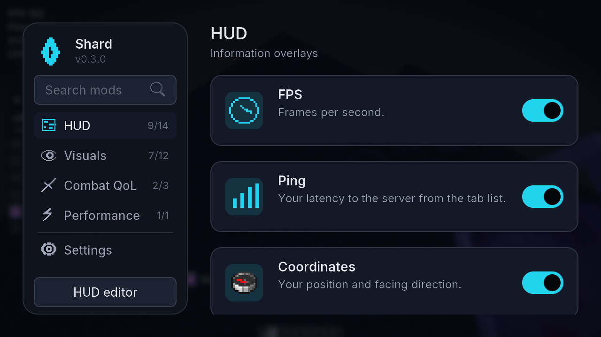
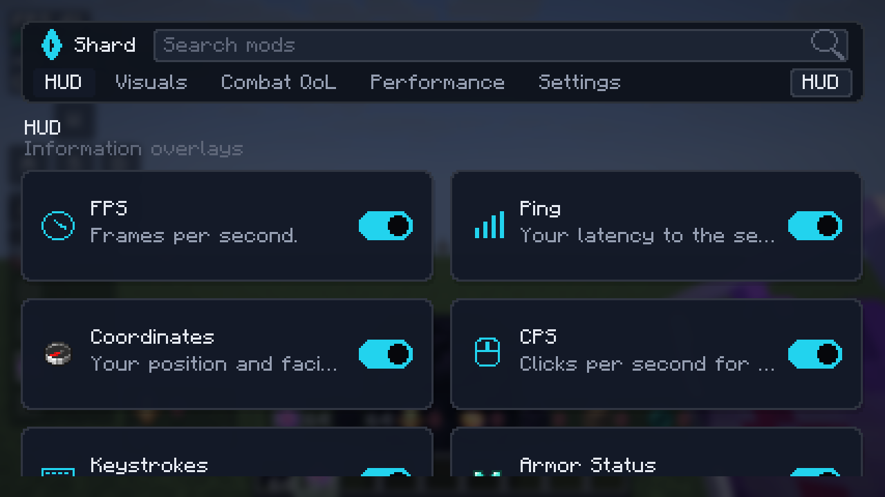
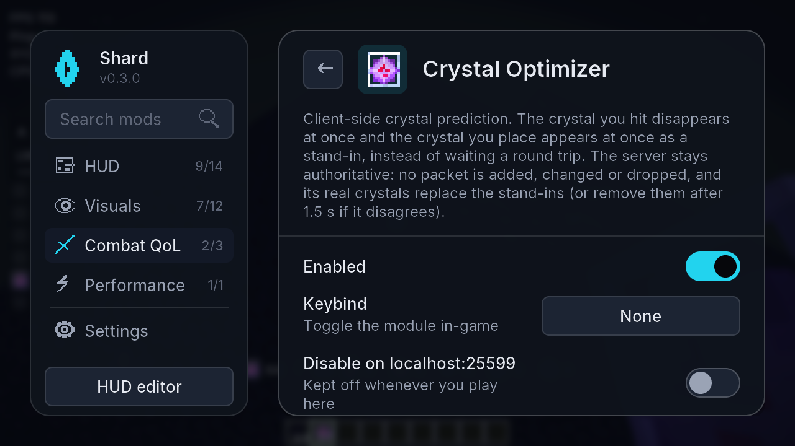
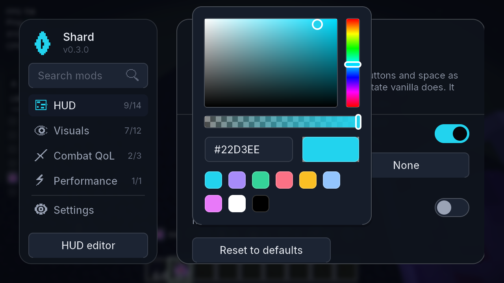
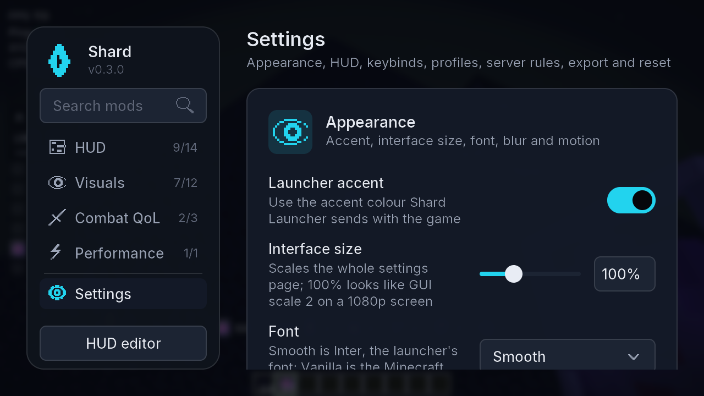
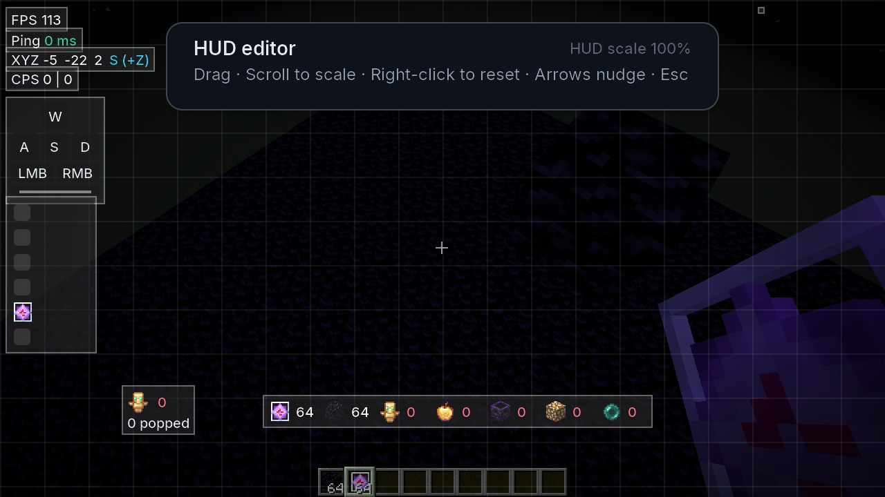
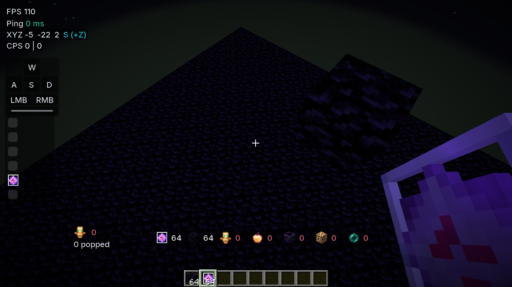
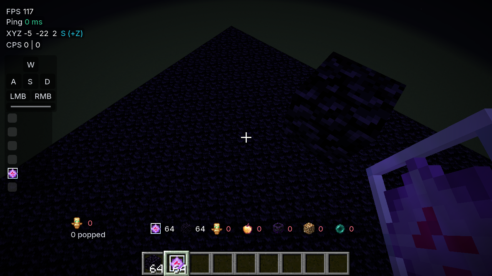
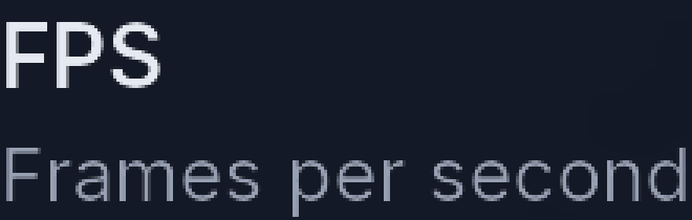
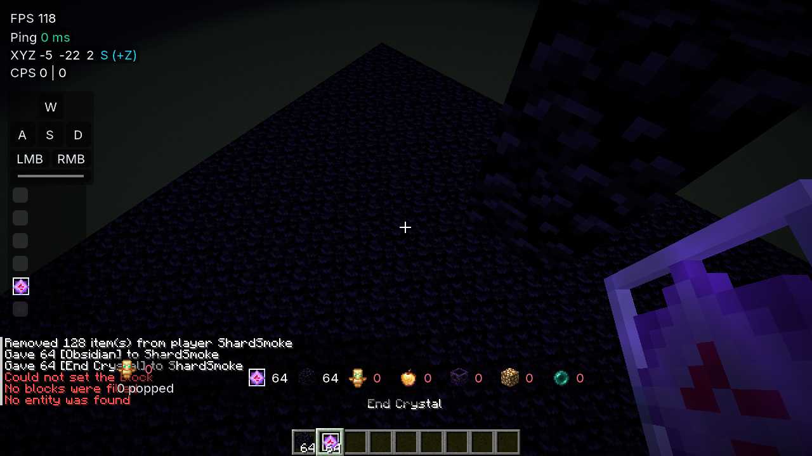

# Shard Client

**Sharpen your crystal PvP.** A legit, server-safe Fabric client for Minecraft 1.21.11: a
Lunar-style settings page, HUD and visual modules tuned for crystal fights, client-side
prediction for crystals and anchors that keeps the server authoritative, and performance tweaks
that are measured rather than assumed. It is the client half of Shard; the launcher lives at
[OhMarker/shard-launcher](https://github.com/OhMarker/shard-launcher) and defines the data
contract (`CONTRACT.md` there).

## Fair-play stance

Shard never automates combat or inventory, never changes movement or timing, never sends packets
the vanilla client would not send, and never reveals information the vanilla client hides. Every
feature is visual, informational, cosmetic, predictive-but-server-authoritative, or
performance-related. Features some servers still restrict can be switched off per server from
the module's own settings panel ("Disable on <server>"), and the rule applies automatically every
time you join that address.

When another installed mod already provides a feature (Marlow's Crystal Optimizer, Client Side
Crystals, the anchor optimizers, No Death Animation, BetterHurtCam, WI Zoom, SprintByDefault,
Custom Crosshair, TotemCounter, Sodium Fullbright, Visual Tweaks' hurt tint), Shard's equivalent
stays off and the card says why, so nothing is ever applied twice.

## Modules (0.3.0)

| Category | Modules |
| --- | --- |
| HUD | FPS, Ping, Coordinates, CPS, Keystrokes, Armor Status, Totem Counter, Potion Effects, Item Counter, Server Address, Session Stats, Clock, Memory, Hit Delay |
| Visuals | Totem Pop Tweaks, No Hurt Cam, Crystal Size, No Death Animation, Hit Color, Low Fire, Low Shield, Fullbright, Hitboxes, Nametags, Crosshair, Zoom |
| Combat QoL | Crystal Optimizer, Anchor Optimizer, Toggle Sprint |
| Performance | Explosion Optimizer |

Highlights:

- **Crystal Optimizer**: the crystal you hit disappears at once (Marlow-style) and the crystal
  you place appears at once as a client-only stand-in that the server's real crystal replaces
  (Client Side Crystals-style). Options for explosion-based removal, hit sound/particles and a
  pulse on crystals you placed. No packet is added, changed or dropped.
- **Anchor Optimizer**: the anchor you detonate vanishes immediately and the explosion sound
  plays right away; the server's own copy of that sound and particle burst is skipped so nothing
  doubles up. Vanilla already predicts charging, so only the explosion needed help.
- **Totem Pop Tweaks**: hide the full-screen animation, scale the sound and particles, an
  optional flash, and the "You popped" / "X popped" chat line with per-player session counts.
- **Explosion Optimizer**: thin explosion/smoke/crit particles, replace the huge explosion
  emitter with a single burst, and cap explosion sounds per tick. See `BENCHMARKS.md`.
- **No Death Animation**, **Hit Color** (colour, strength, flash duration), **Low Fire** (with a
  live preview), **Low Shield**, **Fullbright**, **Hitboxes** (vanilla F3+B without the debug
  screen), **Nametags** (health, armour and pops from data the vanilla client already has; scale,
  background opacity, hide own), **Crosshair** (dynamic gap and hit marker), **Zoom** (scroll to
  adjust, optional cinematic camera).

## Settings page

Open it with **Right Shift** (or `.gui` in chat, or Mod Menu → Configure). The page uses Inter,
the launcher's font, and is laid out at a fixed pixel density, so it looks exactly the same at
GUI scale 1, 2, 3, 4 and Auto; only Settings → Appearance → Interface size changes its size.
A sidebar lists the categories with on/off counts and a search box; the main area is a grid of
mod cards (icon in a tinted square, two-line description, toggle switch). Click a card to slide
in its settings panel: an About paragraph that says exactly what the module does and does not
do, then the keybind, "Disable on this server", reset, and every setting grouped under section
titles, with switches, sliders with a numeric field you can type into, dropdowns, a colour
picker (swatch, hex, Edit), keybind capture and text fields. Rest the pointer on a setting to
see its details line. On small windows (under about 920 px wide) the sidebar becomes a tab strip
and the panel replaces the grid.

Keyboard: Tab / Shift+Tab move focus, Enter or Space activates, arrows adjust sliders and
dropdowns or move between cards, Esc closes the popover, then the panel, then the screen,
`/` or Ctrl+F jumps to search.

The **Settings** entry holds:

- **Appearance**: accent colour (the launcher's by default, or your own), interface size
  75–150%, font (Smooth = Inter, or Vanilla), background blur strength, reduce motion, and
  smooth corners.
- **HUD**: the global HUD scale (normalised so the HUD also looks the same at every GUI scale)
  and the default style every HUD element inherits: Card, Minimal or Outlined, text and value
  colours, background colour and opacity, corner radius, padding, text shadow and alignment.
  Any HUD module can switch on "Custom style" to keep its own values; each also has its own
  label text (for example "FPS" can become "fps" or be hidden).
- **Keybinds**: every module keybind in one list, with capture buttons and a warning when a key
  is shared with another module or a vanilla control.
- **Profiles** with an optional description, **Server rules** with an editor for wildcard
  patterns (`*.example.net`, `host:port`) and a per-rule module list, **Export and import**
  (copy the config JSON to the clipboard, paste one back), **Reset** (with a confirmation) and
  **About**.

The HUD editor (button in the sidebar, or `.hud`) drags, scales, snaps and nudges every HUD
element; its per-element scale multiplies the global HUD scale.

Chat commands use the `.` prefix and never reach the server: `.toggle <module>`,
`.bind <module> <key|none>`, `.set <module> <setting> <value>` (also `.set appearance font vanilla`),
`.reset <module>`, `.config save|load|list [name]`, `.gui`, `.hud`, `.list`, `.help`.

### Screenshots

Taken by the smoke test on the offline test server (1280x720 dev window). The page is the same
at every GUI scale; the 4x crops show the anti-aliased text.

| | |
| --- | --- |
|  |  |
|  |  |
|  |  |
|  |  |
|  |  |

## Launcher integration

- Reads `launcher-info.json` from the game directory on start: the settings page takes the
  launcher's accent colour and theme; the launcher version and instance are logged. Without the
  file everything falls back to defaults, so the mod also works from any other launcher.
- Config lives in `config/shard/config.json` (schema version 3: modules, per-server rules, GUI
  state; 0.2.0 files migrate automatically) so the launcher's shared-config layer can sync it across versions.
- Cosmetics (`equipped.json`) are the next milestone; see "Roadmap".

## Building

```bash
./gradlew build          # build/libs/shard-<version>.jar plus its .sha512, runs the JUnit tests
./gradlew test           # settings, config, launcher-info, keys, colours, server rules, predictors
./gradlew runClient      # dev client with Fabric API, Mod Menu, Sodium, Iris, Lithium, Cloth Config
```

Requires JDK 21 or newer. The bundled Inter font (`assets/shard/font`) is © The Inter Project
Authors under the SIL Open Font License 1.1; the licence ships next to the font files. The
icons are rendered from [Lucide](https://lucide.dev) (ISC licence, `assets/shard/textures/gui/LICENSE-Lucide.txt`)
by `tools/icons/build_icons.py`. Versions of Minecraft, Fabric and the companion mods are pinned in
`gradle.properties`.

### In-game verification

The dev client has a headless smoke test. Start the offline-mode server in `.smoke-server`
(`java -Xmx2G -jar server.jar nogui`; it ops the fixed dev username `ShardSmoke`), then:

```bash
./gradlew runClient -PquickPlay=localhost:25599 -PsmokeDir="$PWD/smoke-out"
```

The client skips onboarding, connects, and at GUI scale 1, 2, 3, 4 and Auto writes the HUD, the
mod grid, an open settings panel, the colour picker, the Settings page and the HUD editor, plus
4x zoomed crops of text; it records the page layout at each scale (`layoutIdenticalAcrossScales`
in the summary). Then it gives itself obsidian and crystals, places a crystal (logging the
instant client-side stand-in), hits it (logging the client-side removal) and writes
`smoke-crystal.png` plus `smoke-summary.json`. Add `-PsmokeBench`
to run the `BENCHMARKS.md` scenario instead; results land in `bench.json`.

## Releasing to the launcher

1. Bump `modVersion` in `gradle.properties` and run `./gradlew build`.
2. Upload `build/libs/shard-<version>.jar` to a GitHub release of this repository.
3. Add a build entry to `shard-manifest.json` in the `meta` repository with the jar URL, the
   sha512 from `build/libs/shard-<version>.jar.sha512`, `"minecraft": ["1.21.11"]` and a
   changelog, then bump `latest`. Every launcher installs it on the next launch.

## Roadmap

- Cosmetics rendering (capes, cloaks, wings, hats, bandanas, back-bling) from the launcher's
  `equipped.json`, and the emote wheel.
- Environment colours (sky, water, foliage) in the spirit of Ambience; shield state colours;
  totem pop ghosts.
- Later versions: 1.21.x and 26.x targets.
