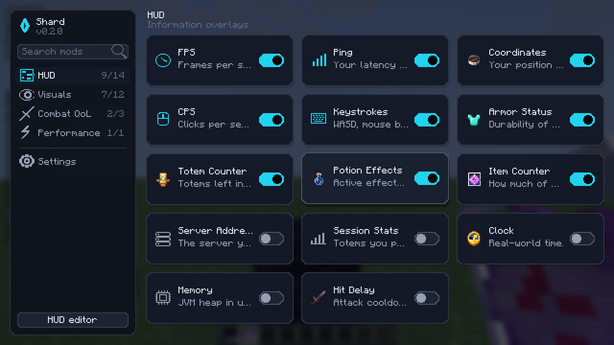
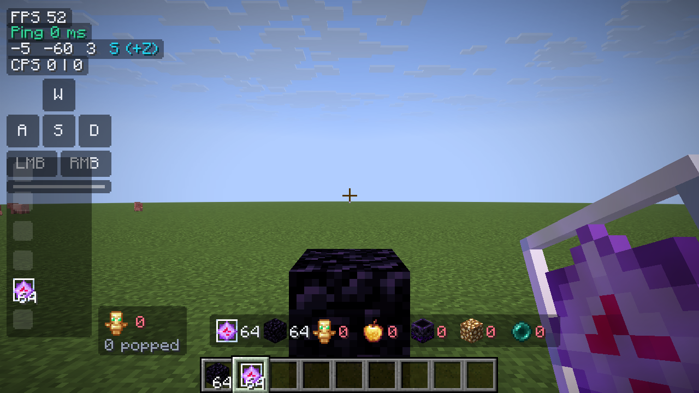

# Shard Client

**Sharpen your crystal PvP.** A legit, server-safe Fabric client for Minecraft 1.21.11: a
Lunar-style settings page, HUD and visual modules tuned for crystal fights, client-side
prediction for crystals and anchors that keeps the server authoritative, and performance tweaks
that are measured rather than assumed. It is the client half of Shard; the launcher lives at
[OhMarker/shard-launcher](https://github.com/OhMarker/shard-launcher) and defines the data
contract (`CONTRACT.md` there).

## Fair-play stance

Shard never automates combat or inventory, never changes movement or timing, never sends packets
the vanilla client would not send, and never reveals information the vanilla client hides. Every
feature is visual, informational, cosmetic, predictive-but-server-authoritative, or
performance-related. Features some servers still restrict can be switched off per server from
the module's own settings panel ("Disable on <server>"), and the rule applies automatically every
time you join that address.

When another installed mod already provides a feature (Marlow's Crystal Optimizer, Client Side
Crystals, the anchor optimizers, No Death Animation, BetterHurtCam, WI Zoom, SprintByDefault,
Custom Crosshair, TotemCounter, Sodium Fullbright, Visual Tweaks' hurt tint), Shard's equivalent
stays off and the card says why, so nothing is ever applied twice.

## Modules (0.2.0)

| Category | Modules |
| --- | --- |
| HUD | FPS, Ping, Coordinates, CPS, Keystrokes, Armor Status, Totem Counter, Potion Effects, Item Counter, Server Address, Session Stats, Clock, Memory, Hit Delay |
| Visuals | Totem Pop Tweaks, No Hurt Cam, Crystal Size, No Death Animation, Hit Color, Low Fire, Low Shield, Fullbright, Hitboxes, Nametags, Crosshair, Zoom |
| Combat QoL | Crystal Optimizer, Anchor Optimizer, Toggle Sprint |
| Performance | Explosion Optimizer |

Highlights:

- **Crystal Optimizer**: the crystal you hit disappears at once (Marlow-style) and the crystal
  you place appears at once as a client-only stand-in that the server's real crystal replaces
  (Client Side Crystals-style). Options for explosion-based removal, hit sound/particles and a
  pulse on crystals you placed. No packet is added, changed or dropped.
- **Anchor Optimizer**: the anchor you detonate vanishes immediately and the explosion sound
  plays right away; the server's own copy of that sound and particle burst is skipped so nothing
  doubles up. Vanilla already predicts charging, so only the explosion needed help.
- **Totem Pop Tweaks**: hide the full-screen animation, scale the sound and particles, an
  optional flash, and the "You popped" / "X popped" chat line with per-player session counts.
- **Explosion Optimizer**: thin explosion/smoke/crit particles, replace the huge explosion
  emitter with a single burst, and cap explosion sounds per tick. See `BENCHMARKS.md`.
- **No Death Animation**, **Hit Color**, **Low Fire**, **Low Shield**, **Fullbright**,
  **Hitboxes** (vanilla F3+B without the debug screen), **Nametags** (health, armour and pops
  from data the vanilla client already has), **Crosshair**.

## Settings page

Open it with **Right Shift** (or `.gui` in chat, or Mod Menu → Configure). A sidebar lists the
categories with on/off counts and a search box; the main area is a grid of mod cards with
Lunar-style toggle switches. Click a card to slide in its settings panel: keybind, "Disable on
this server", reset, then every setting as a tidy row (switches, sliders with values, dropdown
lists, a real colour picker with hue bar, brightness square, alpha and hex field, keybind
capture, text fields), grouped under small headings. On narrow screens (GUI scale 3 at 720p,
Auto at 1080p and above) the sidebar becomes a tab strip and the panel replaces the grid.

Keyboard: Tab / Shift+Tab move focus, Enter or Space activates, arrows adjust sliders and
dropdowns or move between cards, Esc closes the popover, then the panel, then the screen,
`/` or Ctrl+F jumps to search.

The **Settings** entry holds profiles (save, load, delete), the per-server rules and the About
box. The HUD editor (button in the sidebar, or `.hud`) drags, scales, snaps and nudges every HUD
element.

Chat commands use the `.` prefix and never reach the server: `.toggle <module>`,
`.bind <module> <key|none>`, `.set <module> <setting> <value>`, `.reset <module>`,
`.config save|load|list [name]`, `.gui`, `.hud`, `.list`, `.help`.

### Screenshots

Taken by the smoke test on the offline test server (1280x720 dev window).

| | |
| --- | --- |
|  |  |
|  |  |
|  |  |

## Launcher integration

- Reads `launcher-info.json` from the game directory on start: the settings page takes the
  launcher's accent colour and theme; the launcher version and instance are logged. Without the
  file everything falls back to defaults, so the mod also works from any other launcher.
- Config lives in `config/shard/config.json` (schema version 2: modules, per-server rules, GUI
  state) so the launcher's shared-config layer can sync it across versions.
- Cosmetics (`equipped.json`) are the next milestone; see "Roadmap".

## Building

```bash
./gradlew build          # build/libs/shard-<version>.jar plus its .sha512, runs the JUnit tests
./gradlew test           # settings, config, launcher-info, keys, colours, server rules, predictors
./gradlew runClient      # dev client with Fabric API, Mod Menu, Sodium, Iris, Lithium, Cloth Config
```

Requires JDK 21 or newer. Versions of Minecraft, Fabric and the companion mods are pinned in
`gradle.properties`.

### In-game verification

The dev client has a headless smoke test. Start the offline-mode server in `.smoke-server`
(`java -Xmx2G -jar server.jar nogui`; it ops the fixed dev username `ShardSmoke`), then:

```bash
./gradlew runClient -PquickPlay=localhost:25599 -PsmokeDir="$PWD/smoke-out"
```

The client skips onboarding, connects, and writes `smoke-hud.png`, the mod grid, an open settings
panel and the colour picker at GUI scale 3 and 2, the HUD editor, then gives itself obsidian and
crystals, places a crystal (logging the instant client-side stand-in), hits it (logging the
client-side removal) and writes `smoke-crystal.png` plus `smoke-summary.json`. Add `-PsmokeBench`
to run the `BENCHMARKS.md` scenario instead; results land in `bench.json`.

## Releasing to the launcher

1. Bump `modVersion` in `gradle.properties` and run `./gradlew build`.
2. Upload `build/libs/shard-<version>.jar` to a GitHub release of this repository.
3. Add a build entry to `shard-manifest.json` in the `meta` repository with the jar URL, the
   sha512 from `build/libs/shard-<version>.jar.sha512`, `"minecraft": ["1.21.11"]` and a
   changelog, then bump `latest`. Every launcher installs it on the next launch.

## Roadmap

- Cosmetics rendering (capes, cloaks, wings, hats, bandanas, back-bling) from the launcher's
  `equipped.json`, and the emote wheel.
- Environment colours (sky, water, foliage) in the spirit of Ambience; shield state colours;
  totem pop ghosts.
- Wildcard server rules editor (today rules are per exact host; `*.domain` patterns work when
  edited in `config.json`).
- Later versions: 1.21.x and 26.x targets.
