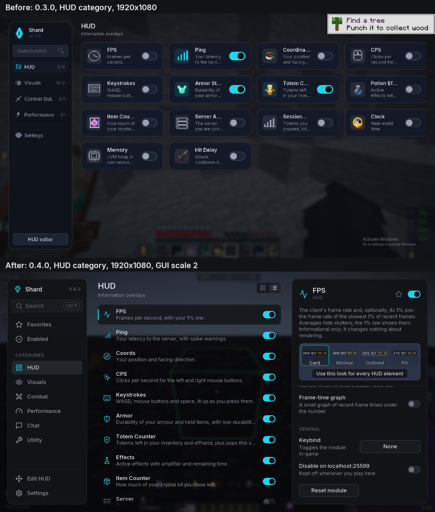
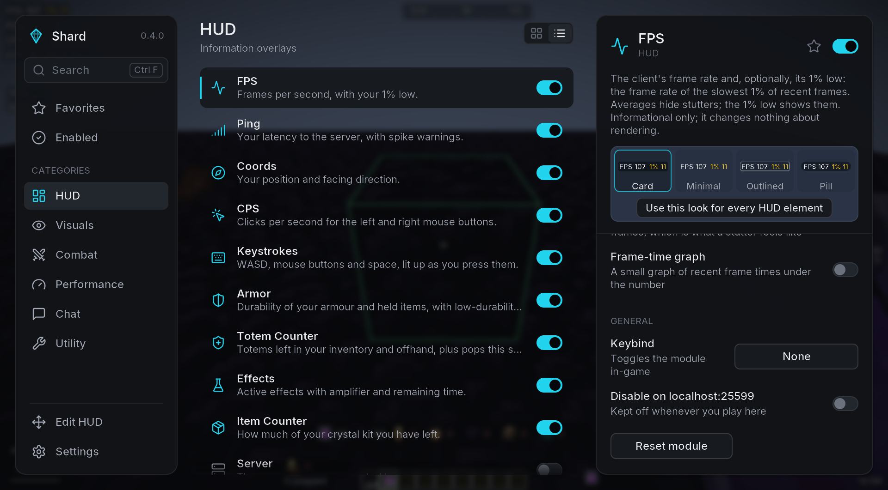
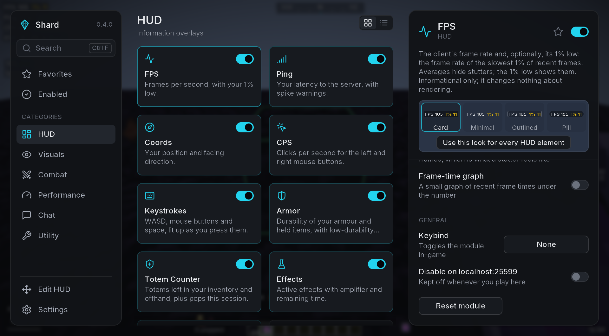
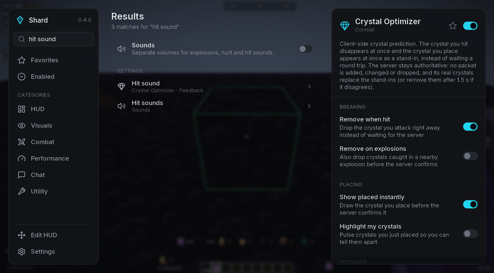
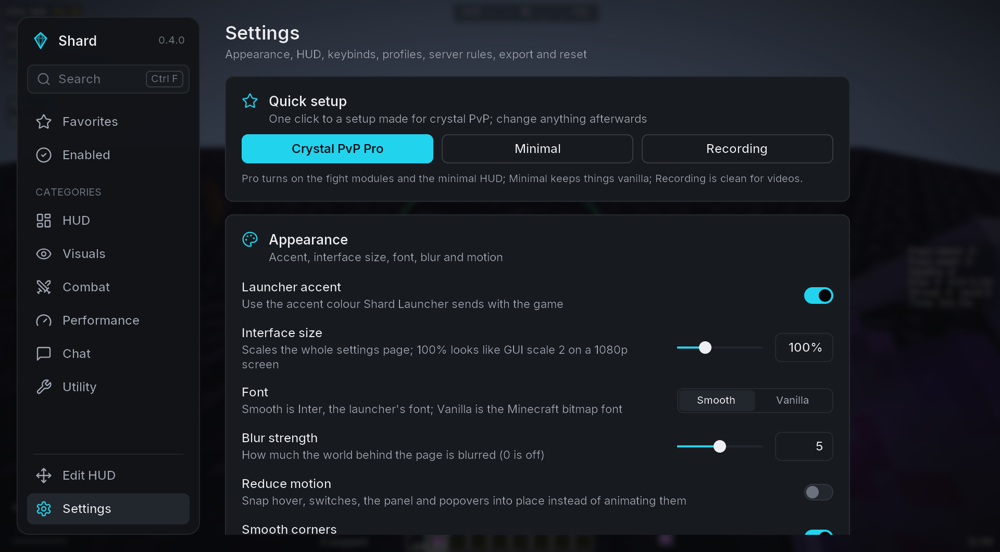
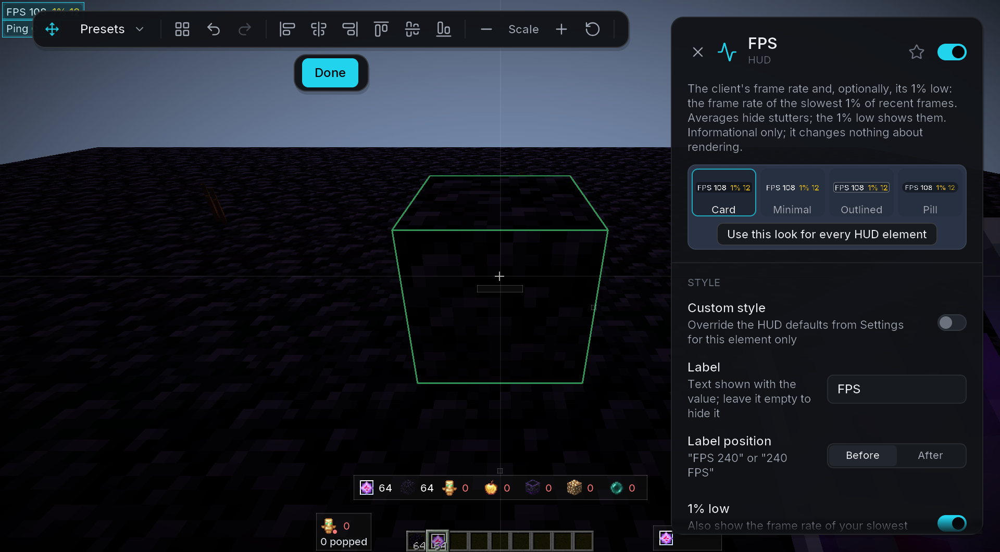
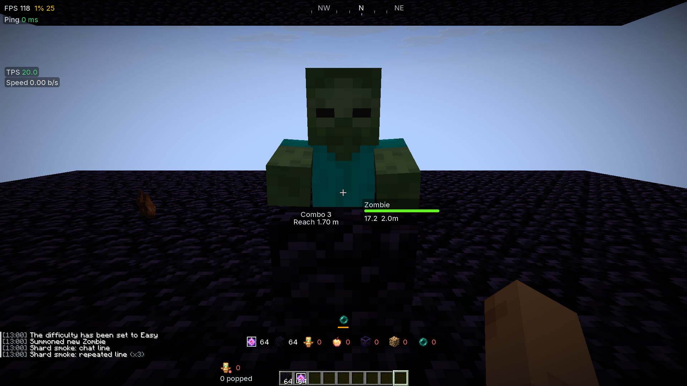
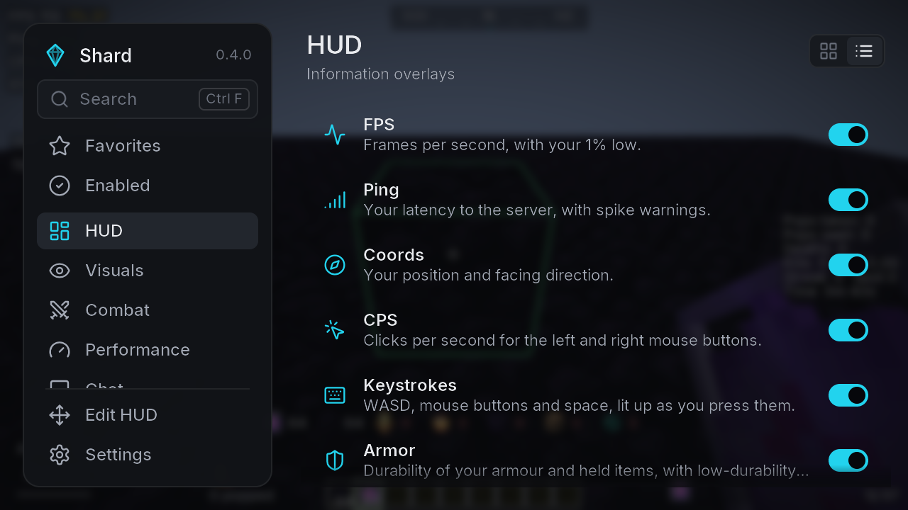
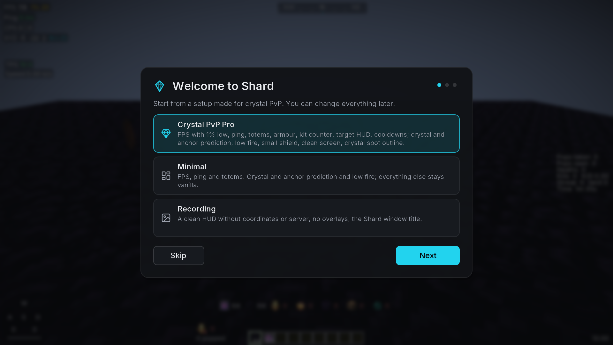

# Shard Client

**Sharpen your crystal PvP.** A legit, server-safe Fabric client for Minecraft 1.21.11: a
clean settings menu, HUD and visual modules tuned for crystal fights, client-side
prediction for crystals and anchors that keeps the server authoritative, and performance tweaks
that are measured rather than assumed. It is the client half of Shard; the launcher lives at
[OhMarker/shard-launcher](https://github.com/OhMarker/shard-launcher) and defines the data
contract (`CONTRACT.md` there).

## Fair-play stance

Shard never automates combat or inventory, never changes movement or timing, never sends packets
the vanilla client would not send, and never reveals information the vanilla client hides. Every
feature is visual, informational, cosmetic, predictive-but-server-authoritative, or
performance-related. Features some servers still restrict can be switched off per server from
the module's own settings panel ("Disable on <server>"), and the rule applies automatically every
time you join that address.

When another installed mod already provides a feature (Marlow's Crystal Optimizer, Client Side
Crystals, the anchor optimizers, No Death Animation, BetterHurtCam, WI Zoom, SprintByDefault,
Custom Crosshair, TotemCounter, Sodium Fullbright, Visual Tweaks' hurt tint), Shard's equivalent
stays off and the card says why, so nothing is ever applied twice.

## Modules (0.5.0)

| Category | Modules |
| --- | --- |
| HUD | FPS (with 1% low and an optional graph), Ping (spike warnings, graph), CPS, Coords, Keystrokes, Armor, Totem Counter, Item Counter, Effects, Attack Cooldown, Cooldowns, Target HUD, Combo, Reach, Fight Recap, Session (kills, K/D, streak), Compass, Speed, TPS, Server, Clock, Memory |
| Visuals | Cosmetics (your Shard Launcher cape), Low Fire, Crosshair, Shield, Crystal Visuals, Anchor Glow, Totem Pops, Hit Color, Nametags, Block Outline, Low Health Warning, Clean Screen, Weather and Time, No Hurt Cam, No Death Animation, Fullbright, Hitboxes, Zoom |
| Combat | Crystal Optimizer, Anchor Optimizer, Toggle Sprint |
| Performance | Explosion Optimizer |
| Chat | Chat (timestamps, stacked repeats, hidden joins and leaves, highlighted mentions) |
| Utility | Display (borderless fullscreen, background and menu FPS caps, window title), GUI Scales (inventory, hotbar, scoreboard, tab list, titles, boss bar, chat), Sounds |

New in 0.5.0:

- **Cosmetics**: the cape you equip in Shard Launcher shows on your own player in third person
  and (optionally) on your elytra. High-resolution capes such as the
  4096x2048 OhMarker cape are uploaded with a full mip chain and smooth filtering, so they stay
  sharp up close and do not flicker from a distance. It is only on your screen: other players
  see your normal Minecraft cape, and nothing is sent to the server.

New in 0.4.0:

- **Fight modules** fed by one fight log: Target HUD (head, health, armour, pops, distance),
  Combo, Reach, a Fight Recap after each fight, and kills, K/D and streaks in Session. Hits,
  reach and kills come from what the vanilla client already sees; nothing is sent.
- **Low Fire** covers three fires: your screen, fire and soul fire blocks on the ground (works
  with Sodium), and the flames on burning players and mobs, each with height, opacity and tint.
- **Crosshair** shapes are pixel masks with an outline that follows any shape, a 15x15 pixel
  editor, a live preview on sky, grass, stone, netherrack or end stone, and share codes.
- **Shield** with separate size and position while blocking and while just holding it.
- **Crystal Visuals** (core and frame colours, spin, bounce, base, aimed-crystal outline) and
  **Anchor Glow** (anchors near you outlined by charge, never through walls).
- **GUI Scales**: the inventory at its own GUI scale with exact clicks, and separate scales for
  the hotbar, scoreboard, tab list, titles, boss bar and chat.
- **Display**: borderless fullscreen (F11 can use it), FPS caps in the background and in menus.
- **Block Outline** with a crystal-spot hint, **Low Health Warning**, **Clean Screen**,
  **Weather and Time** (client-side only), **Sounds** (volumes for explosions, hurt, hits).
- **Quick setup**: Crystal PvP Pro, Minimal or Recording in one click, from a three-step welcome
  the first time you join a world, or from Settings any time.

The 0.3.0 highlights still apply:

- **Crystal Optimizer**: the crystal you hit disappears at once (Marlow-style) and the crystal
  you place appears at once as a client-only stand-in that the server's real crystal replaces
  (Client Side Crystals-style). An optional readout compares predicted and confirmed breaks.
  No packet is added, changed or dropped.
- **Anchor Optimizer**: the anchor you detonate vanishes immediately and the explosion sound
  plays right away; the server's own copy of that sound and particle burst is skipped.
- **Totem Pops**: hide the full-screen animation, scale the sound and particles, an optional
  flash, and the "You popped" / "X popped" chat line with per-fight counts.
- **Explosion Optimizer**: thinner explosion particles, one burst instead of the huge emitter,
  a cap on explosion sounds per tick. Measured in `BENCHMARKS.md`.

## The menu

Open it with **Right Shift** (or `.gui` in chat, or Mod Menu, Configure). It is laid out in
fixed design units with Inter, so it looks the same at GUI scale 1, 2, 3, 4 and Auto; only
Settings, Appearance, Interface size changes its size. Text is rasterised at the real
on-screen size and every icon comes from one set (Lucide).

- **Rail** on the left: search, Favorites, Enabled, the six categories, Edit HUD and Settings.
- **List** (or Grid) of modules: icon, full name, one line of description and a switch. Names
  are never cut off.
- **Detail column**: the module's About paragraph, a live preview where it helps (HUD styles,
  crosshair, fire, shield, crystals), then every setting with switches, sliders you can type
  into, segmented controls, dropdowns, a colour picker and keybind capture. From 1640 px wide it
  is always visible; on smaller windows it slides over the list with a back button.
- **Search** covers module names, descriptions and setting names; picking a setting opens its
  module and flashes the row. Type anywhere to start searching; Ctrl+F also works.
- **Keyboard**: arrows move, Space toggles, Enter opens, right-click toggles, Esc backs out.

**Settings** holds Quick setup, Appearance (accent colour, interface size, font, blur, reduce
motion), HUD (global scale and the shared style: Card, Minimal, Outlined or Pill, colours,
label position, brackets), Keybinds (with conflict warnings), Profiles, Server rules with
wildcard patterns, Export and import, Reset and About.

The **HUD editor** (Edit HUD, or `.hud`) snaps elements to edges, centre lines and each other
with guide lines, selects several with Shift-click or a drag box, aligns and distributes,
nudges by one pixel with the arrows, scales with the scroll wheel, has undo and redo, an
optional grid and layout presets (Crystal PvP minimal, Crystal PvP full, Streamer, plus your
own). Clicking an element opens its settings next to the HUD. Positions are stored as an
anchor plus an offset, so an element near an edge stays the same distance from it at any
window size or GUI scale.

Chat commands use the `.` prefix and never reach the server: `.toggle <module>`,
`.bind <module> <key|none>`, `.set <module> <setting> <value>`, `.reset <module>`,
`.config save|load|list [name]`, `.gui`, `.hud`, `.list`, `.help`.

### Screenshots

Taken by the smoke test on the offline test server. Before and after, HUD category at
1920x1080, GUI scale 2:



| | |
| --- | --- |
|  |  |
|  |  |
|  |  |
|  |  |

More, step by step, in `docs/screenshots/0.4.0/`.

## Launcher integration

- Reads `launcher-info.json` from the game directory on start: the settings page takes the
  launcher's accent colour and theme; the launcher version and instance are logged. Without the
  file everything falls back to defaults, so the mod also works from any other launcher.
- Config lives in `config/shard/config.json` (schema version 3: modules, per-server rules, GUI
  state; 0.2.0 files migrate automatically) so the launcher's shared-config layer can sync it across versions.
- Cosmetics: the cape equipped in the launcher (`equipped.json`; the launcher caches its texture next to it) is drawn on your player.

## Building

```bash
./gradlew build          # build/libs/shard-<version>.jar plus its .sha512, runs the JUnit tests
./gradlew test           # settings, config, launcher-info, keys, colours, server rules, predictors
./gradlew runClient      # dev client with Fabric API, Mod Menu, Sodium, Iris, Lithium, Cloth Config
```

Requires JDK 21 or newer. Versions of Minecraft, Fabric and the companion mods are pinned in
`gradle.properties`.

### Credits

- **Inter** 4.1 by Rasmus Andersson and The Inter Project Authors
  ([rsms.me/inter](https://rsms.me/inter/)), SIL Open Font License 1.1. The fonts and the
  licence ship in `assets/shard/font`; `tools/fonts/gen_fonts.py` writes the font definitions.
- **Lucide** icons ([lucide.dev](https://lucide.dev)) 0.460.0, ISC licence
  (`assets/shard/textures/gui/LICENSE-Lucide.txt`), rendered into atlases by
  `tools/icons/build_icons.py`.

### In-game verification

The dev client has a headless smoke test. Start the offline-mode server in `.smoke-server`
(`java -Xmx2G -jar server.jar nogui`; it ops the fixed dev username `ShardSmoke`), then:

```bash
./gradlew runClient -PquickPlay=localhost:25599 -PsmokeDir="$PWD/smoke-out" -PwindowSize=1920x1080
```

The client skips onboarding, connects and screenshots the HUD, the menu (list, grid, search,
jump to a setting, the HUD category), module panels, the colour picker, Settings and the HUD
editor at GUI scale 1, 2, 3, 4 and Auto, plus 4x crops of text. It then goes through the
editor (drag, presets, undo), every step-6 module against vanilla (fire, crosshair, shield,
crystals, anchors), the inventory at its own scale (the pointer visits all 47 slots),
borderless fullscreen, a fight against a zombie and the crystal place/hit check. The summary
(`smoke-summary.json`) records among others `layoutIdenticalAcrossScales`,
`inventoryScaleSlotMisses`, `borderlessCoversMonitor`, `fightLogKills` and `clippedTexts`
(every text that had to be shortened with an ellipsis). `-PwindowSize` defaults to 1280x720.
Add `-PsmokeBench` to run the `BENCHMARKS.md` scenario instead; results land in `bench.json`.

## Releasing to the launcher

1. Bump `modVersion` in `gradle.properties` and run `./gradlew build`.
2. Upload `build/libs/shard-<version>.jar` to a GitHub release of this repository.
3. Add a build entry to `shard-manifest.json` in the `meta` repository with the jar URL, the
   sha512 from `build/libs/shard-<version>.jar.sha512`, `"minecraft": ["1.21.11"]` and a
   changelog, then bump `latest`. Every launcher installs it on the next launch.

## Roadmap

- More cosmetic types (hats, wings and so on) and the emote wheel; showing capes to other Shard
  players would need a Shard server and is not planned yet.
- Environment colours (sky, water, foliage) in the spirit of Ambience; shield state colours;
  totem pop ghosts.
- Later versions: 1.21.x and 26.x targets.
